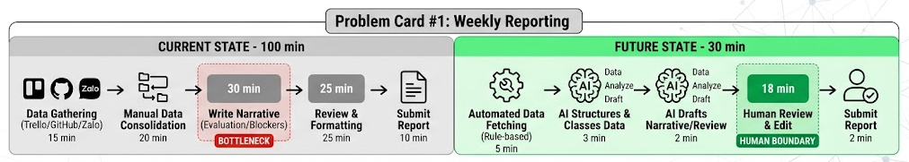
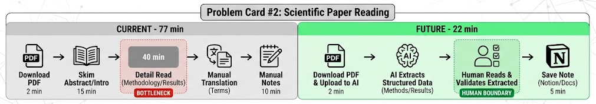
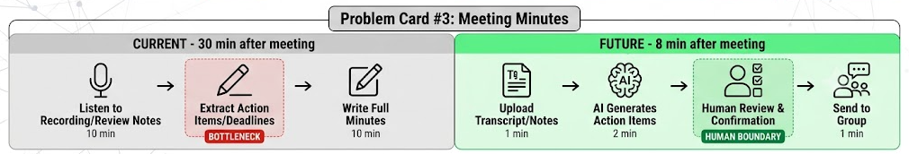

# 01 — Individual Problem Scan

> Điền theo Phase 1 + Phase 2 trong `01-worksheet.md`. Tự scan trước, dùng AI sau để phản biện. Không copy ví dụ Weekly Report.

## Thông tin cá nhân

- Họ và tên: Nguyễn Văn Thăng
- Mã học viên: 2A202602835
- Vai trò / bối cảnh: Sinh viên năm 4 chuyên ngành Trí tuệ nhân tạo / Trưởng nhóm đồ án tốt nghiệp
- Công việc hằng tuần:
  - Đi học trên lớp, làm bài tập lớn, đọc tài liệu/bài báo khoa học tham khảo.
  - Phân công công việc và theo dõi tiến độ của các thành viên trong nhóm làm đồ án.
  - Gom dữ liệu công việc từ Trello, GitHub và tin nhắn nhóm Discord/Zalo.
  - Viết báo cáo tiến độ tuần (Weekly Progress Report) phục vụ buổi họp nhóm và gửi Giảng viên hướng dẫn vào chiều Chủ Nhật.

---

## Phase 1 — Scan 5+ problems (tối thiểu 5, khuyến khích 8-10)

**Cách điền:** mỗi dòng = việc gì + ai chịu + đo bằng gì. Cột `Dấu hiệu thật` bắt buộc có số: mất bao lâu (bấm giờ mấy lần), mấy lần/tuần, bao nhiêu người gặp, log/ticket/quote nào.

| # | Lăng kính (Lặp lại / Tốn thời gian / AI có thể tốt hơn / Pain từ người khác)| Problem quan sát được | Ai chịu ảnh hưởng? | Dấu hiệu thật (số + bằng chứng) |
|---|---|---|---|---|
| 1 | Lặp lại | Chiều T7/Sáng CN hàng tuần phải truy cập Trello, GitHub, Discord/Zalo gom tiến độ để làm slide/file báo cáo họp cuối tuần | Bản thân (Trưởng nhóm), Giảng viên hướng dẫn, Các thành viên | Mất khoảng **100 phút/tuần** (bấm giờ 3 tuần liên tiếp). Tuần nào cũng làm đúng chu trình này. |
| 2 | Tốn thời gian | Đọc và tóm tắt bài báo khoa học / tài liệu tham khảo tiếng Anh (10-15 trang) phục vụ đồ án | Bản thân, Các thành viên trong nhóm | Mất **60–90 phút/bài**; mỗi tuần cần đọc ít nhất 2 bài để đưa vào phần tổng quan báo cáo. |
| 3 | Lặp lại | Tổng hợp danh sách task tồn đọng (backlog/blocker) từ tuần cũ sang tuần mới và viết checklist giao việc | Các thành viên trong nhóm | Mất **30 phút/tuần**; thường xuyên bỏ sót các task phụ hoặc thảo luận bị "trôi" trên Zalo/Discord. |
| 4 | Pain từ người khác | Giảng viên hướng dẫn hỏi đột xuất về tiến độ chi tiết của một thành viên, phải lội tin nhắn tìm lại bằng chứng/kết quả | Giảng viên, Bản thân | Mất **15–20 phút/lần** tìm kiếm lại file/code link; trung bình 2-3 lần/tháng. |
| 5 | AI có thể tốt hơn | Soạn biên bản cuộc họp (Meeting Minutes) sau buổi họp báo cáo tiến độ chiều Chủ Nhật | Toàn bộ thành viên nhóm | Mất **30 phút/buổi họp** để gõ lại nội dung thảo luận, phân công công việc và deadline. |
| 6 | Tốn thời gian | Tìm và sửa lỗi code (debug) theo phản hồi/log lỗi của giảng viên hoặc test case | Thành viên viết code, Bản thân | Mất **2–3 tiếng/lần** nếu lỗi liên quan đến cấu trúc hoặc tích hợp module. |
| 7 | AI có thể tốt hơn | Viết email báo cáo tiến độ tuần / xin lịch hẹn hỗ trợ tới Giảng viên hướng dẫn sao cho chuẩn trang trọng (formal) | Bản thân | Mất **20 phút/email** do cân nhắc từ ngữ, sửa đi sửa lại. |
| 8 | Pain từ người khác | Thành viên nhóm nộp báo cáo phần việc cá nhân muộn hoặc viết sơ sài (chỉ ghi "đã xong task X"), phải hỏi lại chi tiết | Bản thân, Thành viên nhóm | Phải nhắn tin đôn đốc 3–4 lần/tuần; mất thêm 15 phút nhắn tin hỏi chi tiết kết quả. |

**AI đã dùng ở Phase 1:**
- **Prompt đã hỏi:** *"Tôi là sinh viên đang làm đồ án tốt nghiệp và làm trưởng nhóm, hằng tuần phải họp báo cáo tiến độ vào cuối tuần. Hãy gợi ý một số công việc lặp đi lặp lại hoặc tốn thời gian mà tôi có thể đang gặp phải."*
- **Ý dùng được:** Gợi ý về việc gom thông tin từ nhiều kênh liên lạc (Discord/Zalo/GitHub) và tổng hợp biên bản họp.
- **Ý bỏ vì không phải pain thật:** Gợi ý "Tự động gửi tin nhắn nhắc lịch học" (không tốn thời gian, cài báo thức là xong).

**Self-check Phase 1:**
- [x] Đủ 5+ dòng, mỗi dòng có actor + số đo cụ thể
- [x] Dùng ít nhất 3/4 lăng kính
- [x] Không có dòng chung chung kiểu "mất nhiều thời gian"

---

## Phase 2 — Top 3 Problem Cards

### 2.1. Chọn top 3

Giữ bài nào: actor cụ thể, workflow vẽ được 3-7 bước, bottleneck ở 1 bước, impact đo được. Loại bài quá rộng.

| Rank | Problem (copy từ bảng scan) | Vì sao chọn (2-3 ý) | Điều còn chưa chắc |
|---|---|---|---|
| **1** | Chiều T7/Sáng CN hàng tuần phải truy cập Trello, GitHub, Discord/Zalo gom tiến độ để làm slide/file báo cáo họp cuối tuần | Workflow cố định hàng tuần, tiêu tốn nhiều thời gian nhất (100 phút), bottleneck rõ ràng ở bước tổng hợp/viết nhận xét (narrative), metric dễ đo lường. | Cách đánh giá chất lượng bản tóm tắt nội dung/tiến độ đã thực sự "sát" với kết quả làm việc thực tế chưa. |
| **2** | Đọc và tóm tắt bài báo khoa học / tài liệu tham khảo tiếng Anh (10-15 trang) phục vụ đồ án | Tốn thời gian (60-90 phút/bài), ảnh hưởng trực tiếp đến chất lượng cơ sở lý thuyết của báo cáo. | AI dễ bị ảo giác (hallucination) khi tóm tắt các công thức toán/thuật toán phức tạp. |
| **3** | Soạn biên bản cuộc họp (Meeting Minutes) sau buổi họp báo cáo tiến độ chiều Chủ Nhật | Lặp lại hàng tuần, giúp nhóm theo dõi task rõ ràng sau khi họp xong. | Cần đầu vào là file ghi âm hoặc text transcript có độ chính xác tương đối. |

---

### 2.2. Problem Cards chi tiết (lặp lại cho cả 3 cards)

#### Problem Card #1 — Tổng hợp Weekly Progress Report cho cuộc họp cuối tuần

```text
Problem 1 câu:
Mỗi cuối tuần (Chiều T7/Sáng CN), trưởng nhóm sinh viên mất khoảng 100 phút tổng hợp dữ liệu từ Trello, GitHub và tin nhắn Discord/Zalo để viết Weekly Report phục vụ cuộc họp nhóm và gửi Giảng viên hướng dẫn, trong đó bước viết phần nhận xét/đánh giá tiến độ (narrative) tốn thời gian nhất và dễ trễ deadline.

Actor:
Sinh viên làm Trưởng nhóm đồ án / nhóm bài tập lớn.

Thời điểm / bối cảnh:
Chiều Thứ Bảy đến Sáng Chủ Nhật hằng tuần, trước buổi họp tiến độ nhóm lúc 14:00 Chủ Nhật.

Current workflow 3-7 bước:
1. Thu thập task status trên Trello (15 phút)
2. Kiểm tra commit/pull request mới trên GitHub (15 phút)
3. Đọc lại tin nhắn/trao đổi chính trên Discord/Zalo nhóm (20 phút)
4. Copy dữ liệu thô vào file Word/Google Docs báo cáo (10 phút)
5. Viết narrative: Đánh giá tiến độ chung, công việc hoàn thành, rủi ro/chậm trễ, kế hoạch tuần tới (30 phút)
6. Định dạng chỉn chu và chuyển thành slide/file PDF (10 phút)

Bottleneck:
Bước 5 — Viết phần nhận xét, đánh giá tiến độ và tổng hợp khó khăn từ dữ liệu thô (mất 30 phút, dễ bị bí từ/sót ý).

Impact:
100 phút/tuần cho 1 sinh viên trưởng nhóm. Ảnh hưởng đến thời gian tự học/làm task cá nhân. Nếu làm vội, báo cáo sơ sài dẫn đến cuộc họp cuối tuần kéo dài lê thê do thiếu thông tin.

Success metric:
Giảm tổng thời gian thực hiện từ 100 phút xuống dưới 35 phút; 100% các blocker (điểm nghẽn) trong tuần được liệt kê chính xác.

Non-AI alternative:
Tạo Google Form để thành viên tự điền báo cáo cá nhân trước T7 + Dùng Trello Automation dashboard. Tuy nhiên vẫn mất công đọc từng form và tự gõ phần nhận xét tổng quan.

AI hypothesis:
Dùng AI gom dữ liệu thô (dạng text/checklist) để tự động phân loại, trích xuất điểm nghẽn (blockers) và draft phần nhận xét tiến độ. Trưởng nhóm chỉ review và chỉnh sửa.

Quick gut:
[ ] No AI / process fix
[ ] Rule
[x] Workflow
[ ] Agent
[ ] Chưa biết
```

**Draft workflow Card #1:**

```text
CURRENT STATE — 100 phút

[1 Lấy Trello: 15'] 
→ [2 Check GitHub: 15'] 
→ [3 Đọc Discord/Zalo: 20'] 
→ [4 Gom vào Docs: 10'] 
→ [5 Viết Narrative: 30']  <-- bottleneck
→ [6 Format & Export: 10']

FUTURE STATE — 30 phút

[1 Gom data nhanh (Text/Export): 5']  -- Script/Rule
→ [2 AI phân loại & trích xuất Blocker: 3']  -- Workflow Step
→ [3 AI draft phần Narrative/Đánh giá: 2']  -- Workflow Step
→ [4 Trưởng nhóm Review & Edit: 18']  <-- human boundary
→ [5 Export PDF/Slide: 2']

Fallback: 
Nếu AI draft nhận xét quá chung chung hoặc sai tiến độ → Trưởng nhóm dùng template cố định và tự điền tay phần narrative.
```



---

#### Problem Card #2 — Tóm tắt bài báo khoa học / tài liệu kỹ thuật cho đồ án

```text
Problem 1 câu:
Sinh viên mất từ 60-90 phút để đọc và ghi chú một bài báo khoa học tiếng Anh, khó trích xuất nhanh được đóng góp chính (contributions) và phương pháp (methodology) để đưa vào báo cáo tuần.

Actor:
Sinh viên thực hiện đồ án / nghiên cứu khoa học.

Thời điểm / bối cảnh:
Trong tuần, khi chuẩn bị tài liệu tham khảo cho báo cáo tiến độ với Giảng viên.

Current workflow 3-7 bước:
1. Tải file PDF bài báo về máy (2 phút)
2. Đọc lướt Abstract, Introduction và Conclusion (15 phút)
3. Đọc chi tiết phần Methodology và Results (40 phút)
4. Dịch các từ vựng/thuật ngữ khó (10 phút)
5. Ghi chú lại tóm tắt vào file Notion/Docs (10 phút)

Bottleneck:
Bước 3 & 4 — Đọc hiểu chi tiết phương pháp kỹ thuật và dịch thuật ngữ chuyên ngành tiếng Anh.

Impact:
Mất 2-3 tiếng/tuần chỉ cho việc đọc 2 bài báo; giảm thời gian viết code/thử nghiệm.

Success metric:
Giảm thời gian đọc-tóm tắt 1 bài báo từ 77 phút xuống còn 22 phút, vẫn nắm đủ 4 ý: Problem, Proposed Method, Results, Limitations.

Non-AI alternative:
Chỉ đọc Abstract và Conclusion + Dùng Google Translate. (Rủi ro: Bỏ sót chi tiết quan trọng ở phần thuật toán).

AI hypothesis:
Dùng AI trích xuất thông tin có cấu trúc từ file PDF theo khung câu hỏi cố định (Problem, Method, Metric, Limitation).

Quick gut:
[ ] No AI / process fix
[ ] Rule
[x] Workflow
[ ] Agent
[ ] Chưa biết
```

**Draft workflow Card #2:**

```text
CURRENT STATE — 77 phút

[1 Tải PDF: 2'] → [2 Đọc lướt: 15'] → [3 Đọc chi tiết: 40']  <-- bottleneck → [4 Dịch từ: 10'] → [5 Note vào Docs: 10']

FUTURE STATE — 22 phút

[1 Tải PDF & Upload AI: 2'] 
→ [2 AI trích xuất theo Cấu trúc (Method/Result/Limitation): 3'] 
→ [3 Sinh viên đọc bản trích xuất & Kiểm tra lại PDF: 12']  <-- human boundary
→ [4 Lưu Note vào Notion: 5']

Fallback:
Nếu bài báo chứa quá nhiều công thức toán AI dịch sai → Đọc thủ công phần Methodology.
```


---

#### Problem Card #3 — Soạn biên bản cuộc họp (Meeting Minutes) sau buổi họp cuối tuần

```text
Problem 1 câu:
Sau cuộc họp báo cáo tiến độ dài 60 phút vào chiều Chủ Nhật, trưởng nhóm mất 30 phút để nghe lại/xem lại ghi chú để soạn biên bản họp và danh sách task (Action Items) phân công cho tuần mới.

Actor:
Sinh viên Trưởng nhóm / Người ghi biên bản họp.

Thời điểm / bối cảnh:
Chiều Chủ Nhật, ngay sau khi kết thúc buổi họp tiến độ nhóm.

Current workflow 3-7 bước:
1. Ghi âm/Ghi chú nháp trong lúc họp (60 phút - trong họp)
2. Xem lại ghi chú nháp/nghe lại đoạn thảo luận mâu thuẫn (10 phút)
3. Tổng hợp danh sách công việc cần làm (Action Items) và deadline (10 phút)
4. Viết lại thành file biên bản hoàn chỉnh và gửi vào box chat nhóm (10 phút)

Bottleneck:
Bước 2 & 3 — Lọc ra chính xác ai làm việc gì, deadline khi nào từ đoạn thảo luận tự do trong buổi họp.

Impact:
Mất 30 phút sau giờ họp. Nếu làm qua loa, các thành viên sẽ quên task hoặc đùn đẩy trách nhiệm trong tuần.

Success metric:
Giảm thời gian soạn biên bản từ 30 phút xuống còn 8 phút sau cuộc họp.

Non-AI alternative:
Yêu cầu từng thành viên tự gõ task của mình vào bảng Trello ngay trong lúc họp.

AI hypothesis:
Dùng AI xử lý đoạn chat/transcript buổi họp để tự động phân loại: Nội dung đã chốt, Action Items (Task + Assignee + Deadline), Rủi ro cần theo dõi.

Quick gut:
[ ] No AI / process fix
[ ] Rule
[x] Workflow
[ ] Agent
[ ] Chưa biết
```

**Draft workflow Card #3:**

```text
CURRENT STATE — 30 phút

[1 Nghe/Xem lại note: 10'] → [2 Lọc Action Items & Deadline: 10']  <-- bottleneck → [3 Viết biên bản & Gửi: 10']

FUTURE STATE — 8 phút

[1 Thả Transcript/Note thô vào AI: 1'] 
→ [2 AI trích xuất Action Items (Task - Person - Deadline): 2'] 
→ [3 Trưởng nhóm Review & Xác nhận: 4']  <-- human boundary
→ [4 Gửi vào nhóm Zalo/Discord: 1']

Fallback:
Nếu AI phân công nhầm người/sai deadline → Trưởng nhóm tự chỉnh lại trên danh sách AI đã tạo.
```


---

### 2.3. Card muốn pitch nhất (chuẩn bị 2 phút)

**Card tôi muốn pitch nhất:**
Problem Card #1 — Tổng hợp Weekly Progress Report cho cuộc họp cuối tuần.

**Vì sao (2-3 câu: workflow gì, số đo gì, impact gì):**
Đây là workflow bắt buộc hằng tuần có tần suất cố định và tiêu tốn nhiều thời gian nhất (100 phút/tuần). Bottleneck nằm ở khâu biến các dữ liệu thô, rải rác (Trello, GitHub, Zalo) thành bài tổng hợp narrative rõ ràng để họp nhóm và báo cáo Thầy/Cô. Giảm thời gian ở đây giúp giải phóng trực tiếp gần 1.5 giờ mỗi cuối tuần cho sinh viên.

**Câu hỏi tôi muốn nhóm challenge (1-2 câu hỏi đúng chỗ yếu):**
1. Dữ liệu đầu vào từ Zalo/Discord rất hỗn loạn và không có cấu trúc, làm sao để đưa vào AI xử lý mà không mất quá nhiều thời gian copy-paste thủ công?
2. Làm thế nào để kiểm soát việc AI không "tự bịa" ra tiến độ công việc (hallucination) khi thành viên trong nhóm làm chưa xong mà AI lại tóm tắt thành đã hoàn thành?

**AI phản biện Card (nếu có):**
- **Điểm yếu AI chỉ ra:** Metric ban đầu ("không bị Giảng viên phản ánh") khó định lượng; bước gom data từ 3 nguồn (Trello, GitHub, Zalo) có thể tốn thời gian hơn dự kiến nếu làm thủ công.
- **Tôi sửa gì:** Sửa lại metric thành *"Giảm tổng thời gian thực hiện từ 100 phút xuống dưới 35 phút và 100% các blocker (điểm nghẽn) trong tuần được liệt kê chính xác"*. Thu hẹp scope gom data: Chỉ copy phần text summary từ Trello và danh sách PR/Commit chính trên GitHub, không cào toàn bộ tin nhắn chat.

### Self-check nộp phần 01
- [x] Có 5+ problems + top 3 Cards đủ field
- [x] Mỗi Card có workflow trước/sau + bottleneck + metric + fallback
- [x] Đã chọn 1 card pitch + câu hỏi challenge